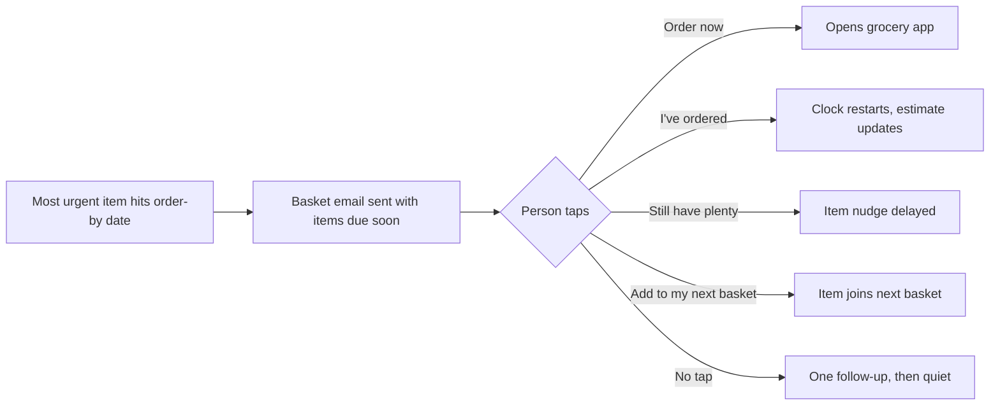

# Grocery Running-Low Nudge: PRD (v1)

Working name: Last Sip. Date: 2026-09-20.

## Problem and opportunity

Households run out of everyday essentials (milk, atta, pet food) at the worst moment, and no app tells them it is about to happen. Grocery apps remember what you bought and let you reorder, but none of them predict when you will run out.

This project is a live, friendly email nudge: "your milk is on its last sip, tap to restock." It works across whichever grocery apps the person already uses, and it learns each household's real consumption rate from a single tap.

**One-line positioning:** a friendly, cross-app, consumption-based restock nudge.

**Why it is a good portfolio project:** it is small enough to ship live, has one clear metric (nudge tap rate), and shows product thinking around a real platform limit. Grocery apps do not offer public APIs to read a user's orders, so the design works around that instead of pretending it does not exist.

## Users and positioning

The target users are busy professionals, roommates and families in Indian metro cities who buy everyday essentials online. For v1, pick one primary group for interviews and treat household size as an input to the prediction. Roommates add a "who orders?" problem, so keep that for later.

**What already exists in India** (from public reviews found in a quick web search; not verified inside the apps):

| Existing feature | Where | Gap this project fills |
| --- | --- | --- |
| Order history and add-back-to-cart | Zepto, Blinkit, Instamart | Only says "you bought this before" |
| Smart Basket and subscriptions | BigBasket | Fixed schedule, not based on real consumption |
| "Your usuals" on the home tab | Several apps | Each app only sees its own orders |

No proactive "you are probably running out" nudge was found, but it could not be ruled out, since apps send their own push notifications that are not fully visible. Action: install the 3-4 major apps for a week and note which reminders they send.

**How this project differs**

1. **Cross-app:** it works for people who order from more than one app.
2. **Consumption-based:** "this is probably running out now", not "you bought this before".
3. **Fun personality:** it feels like a friend, not a sales push.

## V1 scope

V1 is a nudge only: the app tells people what is running low and lets them order from wherever they like.

1. **Sign in with Google.** This reads only the user's name and email address, not their inbox.
2. **Onboarding:**
   - Household size.
   - Pick items from a curated list of everyday items, such as milk, eggs, atta, rice, dal, oil, tea or coffee, cat food and dog food.
   - For each item: "How long does one pack last you?" This is the cold-start answer, since the app does not yet know their habits.
   - Favorite grocery app, and how long they can wait to club items together (see basket batching).
3. **Prediction:** the run-out date is the last restock date plus the estimated days (see the prediction section).
4. **Email nudge** with a fun message and four buttons, grouping items that are due soon into one basket. Delivered to the user's Gmail inbox, at most one digest per day, never at night.
5. **Only everyday items are offered.** Rarely bought things are not in the list, so the app never nudges for them.

**Deliberately not a subscription.** Subscriptions fix a delivery date without knowing the real consumption rate. This product's value is that it adapts to actual use.

## The nudge loop

Because v1 cannot see what people order in other apps, every nudge email carries four buttons, and each tap tells the app something real.

| Button | What it does | What the app learns |
| --- | --- | --- |
| Order now | Opens the person's favorite grocery app, searching for that item | Nudge-to-tap rate |
| I've ordered | Restarts the clock for that item | A real restock date, so the true consumption rate |
| Still have plenty | Pushes the nudge out a few days | The estimate was too short |
| Add to my next basket | Parks the item for the next basket email | The person is not ready to order yet, and the estimate is not wrong |



The "Order now" link passes through this app first, so each click is counted before the person is sent on. That gives a nudge-to-tap number without reading anything from the grocery app.

Later version: reading order receipts from Gmail would replace the manual "I've ordered" tap. It needs Google's security review, so it is out of scope for v1.

## Basket batching

V1 sends one restock basket email instead of one nudge per item, so people can club items into a single order and avoid paying a convenience fee on every small order. Many shoppers prefer to wait a day or two and order everything together. Per-item nudges would push them toward the small, frequent orders that cost them extra.

**How it works**

1. Each item gets an **order-by date**: the last safe day to order before it runs out.
2. The basket email goes out when the most urgent item reaches its order-by date.
3. It also includes every item due within the user's chosen wait window (2-3 days by default).
4. Everything appears in one email, which also keeps to the one-digest-per-day cap.

**User controls**

- **Onboarding question:** "How long can you wait to club items together?" with the options "Just tell me when I need it", "2 days" and "Up to a week".
- **Can't-wait flag per item:** milk, bread and pet food default to "can't wait"; rice, oil and dal default to "can wait". Users can override either.
- **"Add to my next basket" button** in the email, for items the person is not ready to order today. It saves people from misusing "Still have plenty".

**Trade-off:** the longer the wait window, the higher the chance of running out first. The can't-wait flag protects the essentials, and the "ran out before I ordered" rate is tracked as a metric (see success metrics).

**Later:** a fee-aware version ("add ₹X more to avoid the convenience fee") needs live prices and each app's fee rules, which apps do not openly provide. In interviews, ask what order value people aim for to avoid convenience fees.

## Prediction logic

The app starts with the person's own estimate and gradually replaces it with what actually happens.

1. **Cold start:** the person says how long one pack lasts (for example "about 2 weeks"). Household size scales the default suggestion.
2. **Nudge timing:** each item's order-by date is set at roughly 80-90% of the estimated duration, so there is time to order before running out. The basket email goes out on the earliest order-by date (see basket batching).
3. **Learning:** each "I've ordered" tap gives a real gap between two restocks. The estimate shifts toward that real gap.
4. **"Still have plenty" taps** lengthen the estimate slightly and delay the next nudge by a few days.
5. **No response:** one gentle follow-up, then the app goes quiet on that item so it does not nag.
6. **Caps:** at most one digest email per day, sent at sensible hours.

```
order-by date = last restock date + estimated days x 0.85
```

The 0.85 is a starting assumption to tune during real-user testing. Open question: how many restock taps are needed before the learned estimate should outweigh the person's original answer?

## Favorite apps and "Order now" links

Users pick a main grocery app and one backup in onboarding (Blinkit, Zepto, Instamart, BigBasket, or Other). No reliable published figure was found for how many grocery apps a typical Indian user has, so this is a hypothesis to test in the user interviews: "Which grocery apps did you order from last month, and why that one?"

**V1 behavior**

- "Order now" goes to the main app, with a small "Try another app" link for the backup.
- The consumption prediction does not depend on which app was used, because it only needs the restock date from the "I've ordered" tap.

**V1.5 idea:** after "I've ordered", ask one quick question, "Where from?", with the person's apps as tap options. Over time the app can set a default app per item (for example milk from Blinkit, atta from BigBasket).

**Limits to plan for**

- Search links behave differently per app. Some open search results in the app, some open the website, some only the home screen, and phones differ.
- **Do a 30-minute test before building:** try each app's search link on your own phone and note what happens. The result decides what the email promises ("opens search for milk" versus "opens the app").
- **Fallback:** if a link only opens a home page, the nudge should still state clearly what to buy.
- The favorite-app answers and tap rates per app become real data for the case study.

## Out of scope and roadmap

V1 stays small on purpose. Everything below is a candidate for later.

| Idea | Why it waits |
| --- | --- |
| Reading order receipts from Gmail | Needs Google's security review; the "I've ordered" tap covers it for now |
| Cheapest or fastest app routing | Needs live price and delivery-time data that apps do not openly provide |
| WhatsApp nudges | Needs Meta business approval and per-message cost |
| Subscriptions or auto-ordering | Fixes a delivery date without knowing real consumption |
| Barcode scanning, price comparison | Scope creep for a first release |
| Roommate mode (who orders?) | Adds shared-household complexity |
| Fee-aware baskets ("add ₹X more to avoid the convenience fee") | Needs live prices and each app's fee rules, which apps do not openly provide |

**Discovery and revenue hypothesis.** Suggesting something new can help small businesses emerge and may become an ad-based revenue line later. Keep it out of v1 so the nudges stay trusted. Once people trust them, test one clearly labeled "try something new" suggestion per weekly digest and measure clicks. That gives evidence for the revenue idea without hurting the core product.

## Success metrics

The primary metric is the share of nudges where the person taps "Order now" or "I've ordered".

| Metric | Definition | Reads as |
| --- | --- | --- |
| Nudge action rate (primary) | Nudges with an "Order now" or "I've ordered" tap, divided by nudges sent | Higher is better |
| Still-have-plenty rate | "Still have plenty" taps divided by nudges sent | Lower means predictions are improving |
| 4-week retention | Households still active four weeks after sign-up | Higher is better |
| Opt-outs | People who unsubscribe or delete their data | Lower is better |
| Taps per grocery app | "Order now" clicks split by favorite app | Shows real app preferences |
| Ran-out-before-ordered rate | Items the person says they ran out of before they ordered, divided by items nudged | Lower is better; shows whether the wait window is too long |
| Items per basket | Average number of items in each basket email that ends in an order | Higher means more consolidation |

Targets are not set yet. Set them after the first two weeks of real-user data rather than guessing now.

Tracked funnel for the 10-20 invited testers: sign-ups, items added, nudges sent, taps, and reorder-link clicks.

## Personality and message library

The tone is a playful friend who noticed something, never a pushy sales alert. Write 10-15 variants per item type, use the pet's name for pet food, and rotate messages so the same person does not see the same line twice in a row.

| Item type | Example message |
| --- | --- |
| Milk | Your milk is on its last sip. Tap to restock. |
| Cat food | Mittens is staring at the empty bowl. Just saying. |
| Dog food | Bruno has started giving you *the look*. Time to restock. |
| Atta | Atta alert: about 3 days of rotis left. |
| Eggs | Egg supply is getting thin. Breakfast plans in danger. |

The names and lines above are placeholders for tone.

## Risks, pre-build checks and open questions

The biggest risks are emails landing in Promotions or Spam, links that do not open the right place, and predictions that feel wrong early on.

| Risk | What to do |
| --- | --- |
| Emails filed under Promotions or Spam in Gmail | Send from your own domain with proper email setup; test with several Gmail accounts before inviting anyone |
| "Order now" links open the wrong screen | Do the 30-minute link test on your own phone before building |
| Predictions feel wrong at first | Ask for a realistic first estimate, and keep "Still have plenty" one tap away |
| Over-nudging leads to muting | One digest per day, one follow-up, sensible hours |
| Storing what people buy | Short privacy note and a "delete my data" button before inviting users |
| Testing sends real emails | Test with your own address first |
| Waiting to club items means running out first | Can't-wait flag for essentials; default wait of 2 days; track the ran-out-before-ordered rate |

**Before building (about one week)**

- [ ] Interview 5 people: how do they notice they are out of groceries, and which apps did they use last month?
- [ ] Install 3-4 grocery apps for a week and note which reminders they send.
- [ ] Test each app's search link on your phone.
- [ ] Pick the everyday items and typical lifespans.
- [ ] Write the message library.
- [ ] Decide on the domain for sending email.

**Open questions**

- [ ] Which one primary group to interview first: professionals, roommates or families?
- [ ] How many restock taps before the learned estimate outweighs the person's own answer?
- [ ] What tap-rate target counts as success after two weeks of real use?
- [ ] What wait window do people actually choose (2 days or a week), and what order value do they aim for to avoid convenience fees?

## Returning users

**Email first.** Most weeks a returning user never opens the app. Every tap in the basket email (Order now, I've ordered, Still have plenty, Add to next basket) works with no sign-in, and the email footer carries a "Manage my pantry" link.

**Signing in again skips onboarding.** Steps 1-4 appear only for a new account. A returning user lands on "Welcome back" with:

- **Next basket email:** the date and how many items are in it, or "You're stocked up" with the next date when nothing is due.
- **Due soon:** each item with its status and an "I've ordered" button, for orders made outside the email.
- **Stocked up:** the remaining items and their order-by dates.
- **Paused:** items that went quiet after the follow-up went unanswered, with a "Turn back on" button.
- **Add or remove items, Your answers and Delete my data.**

**What the app has learned.** After a few restocks, the app offers to adjust an estimate, for example "You've restocked eggs about every 4 days lately, not every 6. Update to 4 days?" One tap accepts it, so predictions stay accurate.

**Later:** a "Still the right list?" check for items that have not been restocked in a long time.

## Prototype

A clickable prototype of the sign-in, onboarding, pantry, returning-user home and restock email exists as a design prototype. It is private to the owner, so screenshots of every screen are in the `design` folder of this repo. No real emails are sent by the prototype.
